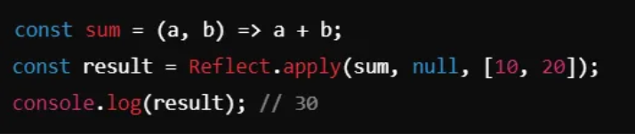

# JavaScript Objekti Haqida

## Obyekt nima?

Obyekt – bu kalit-qiymat (key-value) juftliklari ko‘rinishidagi ma’lumotlar to‘plami. JavaScript obyektlari dinamik bo‘lib, xususiyatlar (properties) va metodlarga ega bo‘lishi mumkin. Obyektlar yordamida murakkab ma'lumotlarni bir joyda saqlash va ulardan foydalanish osonlashadi.

## Obyektni yaratish

JavaScriptda obyektni turli usullar bilan yaratish mumkin:

1. **Literal sintaksis orqali:**

   ```javascript
   const person = {
     name: 'Ali',
     age: 25,
     profession: 'Dasturchi',
   };
   ```

### `new Object()` Konstruktoridan foydalanish

Obyekt yaratishning boshqa usuli - `new Object()` konstruktoridan foydalanish. Bu usul kamroq qo‘llaniladi, chunki obyekt literal usuli tezroq va osonroqdir.

#### Misol:

```javascript
const person = new Object();
person.name = 'Ali';
person.age = 25;
person.profession = 'Dasturchi';

// Natija: { name: "Ali", age: 25, profession: "Dasturchi" }
```

### `Object.create()`

`Object.create()` usuli orqali boshqa obyektni prototip sifatida belgilash orqali yangi obyekt yaratish mumkin. Bu usul yordamida yangi obyekt yaratilganda, u ko‘rsatilgan obyektni prototip sifatida oladi.

#### Misol:

```javascript
const personPrototype = {
  greet: function () {
    console.log(`Salom, mening ismim ${this.name}`);
  },
};

const person = Object.create(personPrototype);
person.name = 'Ali';
person.age = 25;

person.greet();
// Natija: Salom, mening ismim Ali
```

### Xususiyatlarga kirish va ularni o‘zgartirish

Obyektning xususiyatlariga nuqta (`.`) yoki qavs (`[]`) yordamida kirish mumkin.

#### Misol:

```javascript
const person = {
  name: 'Ali',
  age: 25,
};

// Xususiyatga nuqta yordamida kirish
console.log(person.name); // Natija: Ali

// Xususiyatga qavs yordamida kirish
console.log(person['age']); // Natija: 25

// Xususiyatni o‘zgartirish
person.age = 26;
console.log(person.age); // Natija: 26
```

### Xususiyatlarni qo‘shish va o‘chirish

Yangi xususiyatlarni obyektga osongina qo‘shish va olib tashlash mumkin.

#### Misol:

```javascript
const person = {
  name: 'Ali',
  age: 25,
};

// Yangi xususiyat qo'shish
person.profession = 'Dasturchi';
console.log(person.profession); // Natija: Dasturchi

// Xususiyatni o‘chirish
delete person.age;
console.log(person.age); // Natija: undefined
```

### `this` kaliti

`this` kaliti obyekt kontekstiga ishora qiladi va obyekt ichidagi funksiyalarda hozirgi obyektga murojaat qilish uchun ishlatiladi.

#### Misol:

```javascript
const person = {
  name: 'Ali',
  age: 25,
  greet: function () {
    console.log(`Salom, mening ismim ${this.name} va yoshim ${this.age}`);
  },
};

person.greet();
// Natija: Salom, mening ismim Ali va yoshim 25
```

### `Object.keys()`, `Object.values()`, va `Object.entries()`

Bu funksiyalar yordamida obyektning kalitlari, qiymatlari va kalit-qiymat juftlarini olish mumkin.

#### Misol:

```javascript
const person = {
  name: 'Ali',
  age: 25,
  profession: 'Dasturchi',
};

// Kalitlarni olish
const keys = Object.keys(person);
console.log(keys);
// Natija: ["name", "age", "profession"]

// Qiymatlarni olish
const values = Object.values(person);
console.log(values);
// Natija: ["Ali", 25, "Dasturchi"]

// Kalit-qiymat juftlarini olish
const entries = Object.entries(person);
console.log(entries);
// Natija: [["name", "Ali"], ["age", 25], ["profession", "Dasturchi"]]
```

### Obyektlarni Tarqatish (Spread operator)

Spread operator (`...`) yordamida obyektlarni tarqatish, bir obyektni boshqasiga birlashtirish mumkin.

#### Misol:

```javascript
const person = {
  name: 'Ali',
  age: 25,
};

const job = {
  profession: 'Dasturchi',
  company: 'IT kompaniya',
};

// Obyektlarni birlashtirish
const combined = { ...person, ...job };
console.log(combined);
// Natija: { name: "Ali", age: 25, profession: "Dasturchi", company: "IT kompaniya" }
```

### Destructuring

Destructuring yordamida obyektlardan xususiyatlarni oson va qulay tarzda chiqarib olish mumkin. Bu usul kodni yanada oson o‘qilishi va tushunilishini ta'minlaydi.

#### Misol:

```javascript
const person = {
  name: 'Ali',
  age: 25,
  profession: 'Dasturchi',
};

// Destructuring yordamida xususiyatlarni chiqarish
const { name, age } = person;

console.log(name); // Natija: Ali
console.log(age); // Natija: 25
```

### **Object.freeze() va Object.seal()**

- `Object.freeze()` obyektni muzlatadi, ya'ni uning xususiyatlarini o‘zgartirish va yangi xususiyat qo‘shish mumkin emas.
- `Object.seal()` esa faqat yangi xususiyatlarni qo‘shishni taqiqlaydi, lekin mavjud xususiyatlarni o‘zgartirishga ruxsat beradi.

#### Misollar:

```javascript
const person = {
  name: 'Ali',
  age: 25,
};

// Object.freeze() misoli
Object.freeze(person);

person.age = 26; // O'zgartirishga harakat
person.gender = 'erkak'; // Yangi xususiyat qo'shishga harakat

console.log(person);
// Natija: { name: "Ali", age: 25 } - o'zgarishlar amalga oshmadi

// Object.seal() misoli
const job = {
  profession: 'Dasturchi',
};

Object.seal(job);

job.profession = 'Frontend'; // O'zgarishga ruxsat berilgan
job.company = 'IT kompaniya'; // Yangi xususiyat qo'shishga harakat - taqiqlangan

console.log(job);
// Natija: { profession: "Frontend" } - yangi xususiyat qo'shilmaydi, lekin o'zgaradi
```

### Object.assign()

`Object.assign()` bir obyektning xususiyatlarini boshqa obyektga nusxalash imkonini beradi. Bu, asosan, obyektlarni birlashtirish uchun ishlatiladi.

#### Misol:

```javascript
const person = {
  name: 'Ali',
  age: 25,
};

const job = {
  profession: 'Dasturchi',
};

// Object.assign() yordamida obyektlarni birlashtirish
const combined = Object.assign({}, person, job);

console.log(combined);
// Natija: { name: "Ali", age: 25, profession: "Dasturchi" }
```

### Object.defineProperty()

`Object.defineProperty()` orqali siz xususiyatni o'zgartirilmas qilib belgilashingiz mumkin. Bu qiymatni faqat o'qish mumkin qiladi va uni yozish yoki o'zgartirishga ruxsat bermaydi. Bu doimiy qiymatlar yoki **konstantalar** uchun foydalidir.

#### 1. Xususiyatning yozilmasligini ta'minlash (writable: false)

#### Misol:

```javascript
const person = {};

Object.defineProperty(person, 'name', {
  value: 'Ali',
  writable: false, // yozilmasligini ta'minlaydi
  enumerable: true,
  configurable: true,
});

console.log(person.name); // Natija: Ali

person.name = 'Vali'; // O'zgartirishga harakat
console.log(person.name); // Natija: Ali - o'zgarish amalga oshmadi
```

#### 2. Xususiyatlarni yashirish (enumerable: false)

Agar siz xususiyatni **ko'rinmas** qilishni istasangiz, ya'ni `for...in` yoki `Object.keys()` orqali qidirilmasligini ta'minlamoqchi bo'lsangiz, `enumerable: false` bilan bu mumkin. Bu maxfiy yoki texnik ma'lumotlarni foydalanuvchidan yashirishda yordam beradi.

#### Misol:

```javascript
const person = {};

Object.defineProperty(person, 'name', {
  value: 'Ali',
  enumerable: false, // ko'rinmas qilish
  configurable: true,
  writable: true,
});

console.log(person.name); // Natija: Ali

// for...in loop orqali xususiyatlarni ko'rish
for (let key in person) {
  console.log(key); // Hech narsa chop etmaydi
}

// Object.keys() orqali xususiyatlarni ko'rish
console.log(Object.keys(person)); // Natija: [] - xususiyat ko'rinmaydi
```

#### 3. Xususiyatlarni o'chirish yoki o'zgartirishdan himoya qilish (configurable: false)

`configurable: false` xususiyati orqali xususiyatni qayta aniqlash yoki o'chirib bo'lmaydigan qilib qo'yishingiz mumkin. Bu muhim ma'lumotlarni tasodifan yoki qasddan o'chirilishdan himoya qilishda ishlatiladi.

#### Misol:

```javascript
const person = {};

// Xususiyatni aniqlash
Object.defineProperty(person, 'name', {
  value: 'Ali',
  configurable: false, // o'zgartirish va o'chirish mumkin emas
  writable: true,
  enumerable: true,
});

// Xususiyatni qayta aniqlashga harakat
try {
  Object.defineProperty(person, 'name', {
    value: 'Vali', // O'zgartirishga harakat
  });
} catch (error) {
  console.log(error.message); // Natija: Cannot redefine property: name
}

// Xususiyatni o'chirishga harakat
delete person.name; // O'chirishga harakat

console.log(person.name); // Natija: Ali - o'chirilmaydi
```

### Object.defineProperties()

**Ko'p xususiyatlarni bir vaqtda belgilash (`Object.defineProperties`)**

Agar bir nechta xususiyatni boshqarish kerak bo'lsa, `Object.defineProperties()` usuli orqali bir vaqtda bir nechta xususiyatni yaratish yoki o'zgartirish mumkin. Bu katta yoki murakkab obyektlar bilan ishlashda qulay.

#### Misol:

```javascript
const person = {};

// Bir nechta xususiyatlarni belgilash
Object.defineProperties(person, {
  name: {
    value: 'Ali',
    writable: true,
    enumerable: true,
    configurable: true,
  },
  age: {
    value: 25,
    writable: false, // o'zgartirilmas
    enumerable: true,
    configurable: false, // o'chirib bo'lmaydi
  },
  occupation: {
    value: 'Developer',
    writable: true,
    enumerable: true,
    configurable: true,
  },
});

console.log(person); // Natija: { name: 'Ali', age: 25, occupation: 'Developer' }

person.age = 30; // O'zgartirishga harakat
console.log(person.age); // Natija: 25 - o'zgartirish amalga oshmadi

delete person.occupation; // O'chirishga harakat
console.log(person.occupation); // Natija: 'Developer' - o'chirilmaydi
```

### Shallow Copy

**Shallow copy** obyektning birinchi darajali xususiyatlarini ko‘chiradi, lekin ichidagi obyektlar uchun referensni saqlab qoladi. Bu demakdirki, agar ichki obyektlar o'zgartirilsa, u holda asl obyekt ham o'zgaradi.

#### Misol:

```javascript
const originalObject = {
  name: 'Ali',
  age: 30,
  address: {
    city: 'Tashkent',
    country: 'Uzbekistan',
  },
};

// Shallow copy yaratish
const shallowCopy = { ...originalObject }; // Spread operator orqali

// Boshqa usul: Object.assign()
const shallowCopy2 = Object.assign({}, originalObject);

shallowCopy.name = 'Vali'; // O'zgarish
shallowCopy.address.city = 'Samarkand'; // Ichki obyektni o'zgartirish

console.log(originalObject.name); // Natija: Ali - o'zgarish kiritilmagan
console.log(originalObject.address.city); // Natija: Samarkand - o'zgarish kiritilgan
```

### Deep Copy

**Deep copy** esa obyektning barcha darajalarini ko‘chiradi, ya'ni ichki obyektlar ham mustaqil nusxaga ega bo'ladi. Bu holda, asl obyekt o'zgartirilsa, yangi nusxa o'zgarmaydi va aksincha.

#### Misol:

```javascript
const originalObject = {
  name: 'Ali',
  age: 30,
  address: {
    city: 'Tashkent',
    country: 'Uzbekistan',
  },
};

// Deep copy yaratish
const deepCopy = JSON.parse(JSON.stringify(originalObject));

// O'zgarishlarni kiritamiz
deepCopy.name = 'Vali';
deepCopy.address.city = 'Samarkand';

console.log(originalObject.name); // Natija: Ali - o'zgarish kiritilmagan
console.log(originalObject.address.city); // Natija: Tashkent - o'zgarish kiritilmagan
```

## Proxy va Reflect API

### Proxy API

`Proxy` JavaScript-da obyektlarning xatti-harakatlarini o'zgartirish yoki ularga yangi funksionallik qo'shish imkonini beradi. U obyektni ushlab, uni "qo'riqlash" uchun ishlatiladi va har qanday kirish, yozish, o'chirish kabi operatsiyalarni boshqarishga imkon beradi.

### Proxy Tuzilishi

Proxy ikkita asosiy komponentga ega:

- **target**: Asosiy obyekt, ya'ni biz manipulyatsiya qilmoqchi bo'lgan obyekt.
- **handler**: Asosiy obyekt bilan bog'liq bo'lgan barcha operatsiyalarni boshqaradigan funksiya yoki metodlar.

#### Misol:

```javascript
// Asosiy obyekt
const person = {
  name: 'Ali',
  age: 30,
};

// Handler obyekti
const handler = {
  get(target, property) {
    console.log(`Accessing ${property}`);
    return target[property];
  },
  set(target, property, value) {
    console.log(`Setting ${property} to ${value}`);
    target[property] = value;
    return true; // muvaffaqiyatli o'zgartirish
  },
};

// Proxy yaratish
const proxyPerson = new Proxy(person, handler);

// Obyektga murojaat qilish
console.log(proxyPerson.name); // Natija: Accessing name \n Ali
proxyPerson.age = 31; // Natija: Setting age to 31
console.log(proxyPerson.age); // Natija: Accessing age \n 31
```

### Handler Traplari (Metodlari)

Handlerlar deb ataladigan funksiyalar bilan `get`, `set`, `has`, `deleteProperty`, va boshqa ko'plab xatti-harakatlarni boshqarishingiz mumkin.

- **`get`**: Obyektning xususiyatiga kirishga urinishni boshqaradi.
- **`set`**: Xususiyatga qiymat yozishni boshqaradi.
- **`deleteProperty`**: Xususiyatni o'chirishni boshqaradi.
- **`has`**: `in` operatorining ishlashini boshqaradi (masalan, `"x" in obj`).
- **`apply`**: Funksiya sifatida chaqirilishni boshqaradi.

#### `get` Metodi

`get` metodi obyektning xususiyatlariga kirishni boshqarish uchun ishlatiladi. Ushbu metodga `target` obyekt va so'ralayotgan xususiyat nomi argument sifatida uzatiladi.

#### Misol:

```javascript
const person = {
  name: 'Ali',
  age: 30,
};

const handler = {
  get(target, property) {
    console.log(`Accessing ${property}`);
    return target[property];
  },
};

const proxyPerson = new Proxy(person, handler);

// Obyektning xususiyatlariga murojaat qilish
console.log(proxyPerson.name); // Natija: Accessing name \n Ali
console.log(proxyPerson.age); // Natija: Accessing age \n 30
```

### `set` Trap

`set` trap xususiyatga yangi qiymat o'rnatilganda ishlaydi va uni tekshirishi yoki o'zgartirishi mumkin. Ushbu metodga `target` obyekt, xususiyat nomi va yangi qiymat argument sifatida uzatiladi.

#### Misol:

```javascript
const person = {
  name: 'Ali',
  age: 30,
};

const handler = {
  set(target, property, value) {
    console.log(`Setting ${property} to ${value}`);
    // Xususiyatni o'zgartirishdan oldin ba'zi tekshiruvlar
    if (property === 'age' && value < 0) {
      throw new Error("Yoshi manfiy bo'lishi mumkin emas!");
    }
    target[property] = value; // Xususiyatni o'zgartirish
    return true; // muvaffaqiyatli o'zgartirish
  },
};

const proxyPerson = new Proxy(person, handler);

// Obyektning xususiyatiga yangi qiymat o'rnatish
proxyPerson.age = 31; // Natija: Setting age to 31
console.log(proxyPerson.age); // Natija: 31

// Manfiy yosh qiymatini o'rnatishga urinish
try {
  proxyPerson.age = -5; // Natija: Xato: Yoshi manfiy bo'lishi mumkin emas!
} catch (error) {
  console.error(error.message);
}
```

### `deleteProperty` Trap

`deleteProperty` trap obyektning xususiyatlarini o'chirishni boshqaradi. Ushbu metodga `target` obyekt va o'chirilishi kerak bo'lgan xususiyat nomi argument sifatida uzatiladi. Bu trap o'chirish jarayonini nazorat qilish va kerakli shartlar asosida xususiyatni o'chirishga ruxsat berish yoki rad etish imkonini beradi.

#### Misol:

```javascript
const person = {
  name: 'Ali',
  age: 30,
};

const handler = {
  deleteProperty(target, property) {
    console.log(`Deleting ${property}`);
    // Xususiyatni o'chirishdan oldin ba'zi tekshiruvlar
    if (property === 'age') {
      throw new Error("Yoshni o'chirish mumkin emas!");
    }
    delete target[property]; // Xususiyatni o'chirish
    return true; // muvaffaqiyatli o'chirish
  },
};

const proxyPerson = new Proxy(person, handler);

// Obyektning xususiyatini o'chirishga urinish
delete proxyPerson.name; // Natija: Deleting name
console.log(person.name); // Natija: undefined

// Yoshi xususiyatini o'chirishga urinish
try {
  delete proxyPerson.age; // Natija: Xato: Yoshni o'chirish mumkin emas!
} catch (error) {
  console.error(error.message);
}
```

## Reflect API

`Reflect` API obyektlarda amalga oshiriladigan an'anaviy operatsiyalarni (masalan, xususiyat qo'shish, o'chirish, o'qish) bir xil uslubda bajarish uchun ishlatiladi. `Reflect` metodlari orqali bajarilgan harakatlar `Proxy` bilan birga ishlatiladi va ularni an'anaviy usullar bilan amalga oshirish osonlashadi.

### Reflect Metodlari

- **`Reflect.get(target, prop)`**: Obyektning xususiyatini o'qiydi.
- **`Reflect.set(target, prop, value)`**: Obyektning xususiyatiga qiymat o'rnatadi.
- **`Reflect.deleteProperty(target, prop)`**: Obyektning xususiyatini o'chiradi.
- **`Reflect.has(target, prop)`**: Obyektning xususiyatiga `in` operatori bilan kirishni boshqaradi.
- **`Reflect.apply(target, thisArg, argumentsList)`**: Funksiyaga chaqirish qiladi va argumentlarni boshqaradi.

### `Reflect.get` va `Reflect.set`

Bu usullar obyektning xususiyatlarini olish va o'rnatishni standart usulda amalga oshiradi. `Reflect.get` xususiyatni o'qishda, `Reflect.set` esa xususiyatga qiymat o'rnatishda ishlatiladi. Bu metodlar `Proxy` ichida aniqlangan `get` va `set` traplari bilan birgalikda ishlatilishi mumkin, bu esa kodni yanada soddalashtiradi va aniqroq qiladi.

#### Misol:

```javascript
const person = {
  name: 'Ali',
  age: 30,
};

const handler = {
  get(target, prop) {
    console.log(`Getting ${prop}`);
    return Reflect.get(target, prop); // Reflect orqali xususiyatni olish
  },
  set(target, prop, value) {
    console.log(`Setting ${prop} to ${value}`);
    return Reflect.set(target, prop, value); // Reflect orqali xususiyatga qiymat o'rnatish
  },
};

const proxyPerson = new Proxy(person, handler);

// Obyektning xususiyatini olish
console.log(proxyPerson.name); // Natija: Getting name, Ali

// Obyektning xususiyatini o'rnatish
proxyPerson.age = 31; // Natija: Setting age to 31
console.log(proxyPerson.age); // Natija: Getting age, 31
```

### `Reflect.apply:`



### `Reflect.deleteProperty`:

Xususiyatni o'chirishni boshqarish va natijasini qaytaradi.


### **Proxy va Reflect birgalikda ishlatilishi**

`Proxy` bilan birga `Reflect` API ko‘pincha ishlatiladi, chunki bu kodni soddalashtirishga yordam beradi va barcha operatsiyalarni bir joyga jamlash imkonini beradi.

`Proxy` yordamida obyektning xatti-harakatlarini boshqarish imkonini beruvchi handlerlar o'rnatish mumkin. Ushbu handlerlar ichida, `Reflect` metodlaridan foydalanish, har bir operatsiyani an'anaviy tarzda bajarishga yordam beradi va kodning o'qilishi va saqlanishini osonlashtiradi.

#### Misol:

```javascript
const target = {
  message: 'Salom',
};

const handler = {
  get(target, prop, receiver) {
    console.log(`Xususiyatga kirish: ${prop}`);
    return Reflect.get(target, prop, receiver);
  },
  set(target, prop, value) {
    console.log(`Xususiyatga qiymat yozish: ${prop} = ${value}`);
    return Reflect.set(target, prop, value);
  },
};

const proxy = new Proxy(target, handler);

// Obyektning xususiyatlariga kirish
console.log(proxy.message); // Natija: Salom

// Obyektning xususiyatlariga qiymat yozish
proxy.message = 'Hello'; // Natija: Xususiyatga qiymat yozish: message = Hello
```
